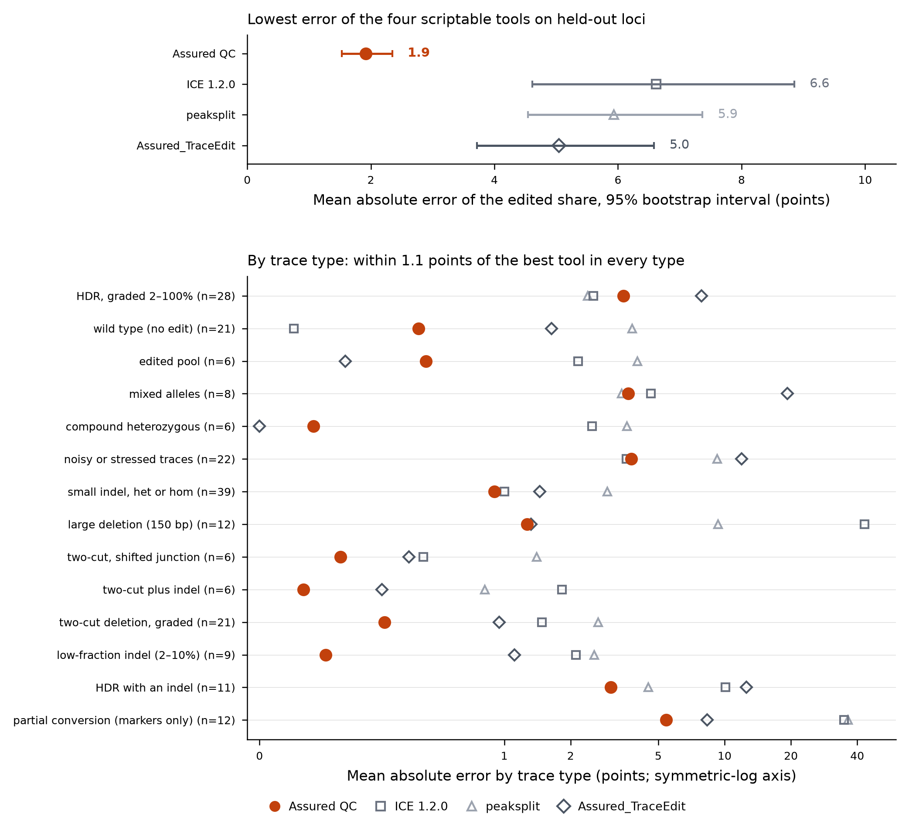

# Results: held-out scorecard (simulated truth, seed 20261010)

Scored with `bench/score.py` and `bench/extras.py` exactly as frozen in `bench/FROZEN.json` (scorer SHA-256 `e50766ce93dae0c3…`, unchanged). Engine state: `bench/ENGINE_FREEZE.json` (2026-10-09T12:20:37Z; 20 test files, 107 pass). The set was generated after the engine was fixed and was never used for tuning. Test loci (L03, L05 exon 4, L06, L08, L10, L05 exon 25) are the loci not used for development; 207 of 398 traces. Points = percentage points of the edited share unless stated.

**What this is and is not.** The truth is built into the traces (real control peaks, known alleles), so every number below measures how well each tool recovers a known mixture on traces that look like our laboratory's, including the simulator's limits (`bench/simlib.py`: no PCR length bias, fewer heavy-tailed bad pairs than real data). It is not a measurement on wet-lab mixtures (protocol in `docs/known-mixture-protocol.md`, not yet run) and not on sequencing-confirmed clones. Only tools that can be scripted here were run: Assured QC, ICE 1.2.0, peaksplit, Assured_TraceEdit. DECODR, TIDE/TIDER, SeqScreener, EditR and Tracy were not run.

## Pre-registered criteria (docs/scorecard.md) and outcome on the held-out test loci

| Criterion | Result | Outcome |
|---|---|---|
| Primary: MAE of the edited share below every comparator, paired bootstrap CI excluding 0 | Assured QC 1.92 (95% CI 1.53-2.35); paired difference ICE +4.55 (2.61 to 6.75), peaksplit +4.01 (2.89 to 5.42), TraceEdit +3.11 (1.88 to 4.49) | met |
| No family worse than the best comparator by more than 2 points | largest shortfall 1.09 (HDR dilutions, vs peaksplit); wild type 0.51 (vs ICE) | met |
| Safety: wild-type traces called >= 2.0 points edited at most 2% | 2 of 21 (9.5%); ICE 1 of 21, TraceEdit 4 of 21, peaksplit 17 of 21. The application's own detected flag (interval lower bound >= 1 point): 0 of 21 | **not met** |
| Safety: false intended edit on partial-conversion clones | 0 (ICE and peaksplit: all) | met |
| Coverage of analysable pairs at least 99% | 206 of 207 on the test loci; 396 of 398 overall (two 150 bp heterozygous deletions whose edited read does not align to the control; reported as errors, not guessed) | met |
| Target: MAE <= 2 for edited share >= 10%, <= 1 for <= 5% | <= 5%: 0.51 (met). 5-25%: 3.15, 25-75%: 2.66 (not met); 75-100%: 1.30 (met) | **partly met** |
| Target: limit of detection <= 2% | 2% truths are detected by the point estimate in 25-33% of traces, 5% in 100% (interval flag: 0% at 2%, 50-100% at 5%) | **not met**; practical limit is about 5% |
| Target: allele recovery >= 95% | 0.99 overall, 0.92 for large deletions | met |
| Target: interval coverage 90-98% | edited share 96.1%, knockout score 95.1% (met); intended-edit share 80.8% (n = 99) | **partly met** |

## Scorecard, held-out test loci (207 traces)

| metric | Assured QC | ICE 1.2.0 | peaksplit | Assured_TraceEdit |
|---|---|---|---|---|
| traces | 207.00 | 207.00 | 207.00 | 207.00 |
| coverage | 0.99 | 1.00 | 1.00 | 0.97 |
| MAE edited | 1.92 | 6.62 | 5.93 | 5.04 |
| CI low | 1.53 | 4.61 | 4.54 | 3.71 |
| CI high | 2.35 | 8.85 | 7.37 | 6.58 |
| median absolute error | 0.60 | 2.00 | 3.12 | 1.21 |
| 95th percentile absolute error | 9.28 | 40.40 | 25.46 | 30.02 |
| WT false positives (>=2.0) | 0.10 | 0.05 | 0.81 | 0.19 |
| MAE intended | 4.24 | 7.02 | 6.57 | 9.33 |
| MAE knockout score | 0.54 | 3.54 | 3.49 | 8.91 |
| allele recovery | 0.99 | 0.94 | 0.98 | 0.90 |
| large-deletion recovery | 0.92 | 0.25 | 0.75 | 0.25 |
| false intended (partial) | 0.00 | 1.00 | 1.00 | 0.00 |
| median s per pair | 0.41 | 9.10 | 0.88 | 0.22 |

Mean absolute error by true edited share:

| tool | truth 0 | truth (0,5] | truth (5,25] | truth (25,75] | truth (75,100] |
|---|---|---|---|---|---|
| Assured QC | 0.65 | 0.51 | 3.15 | 2.66 | 1.30 |
| ICE 1.2.0 | 0.14 | 2.45 | 2.89 | 6.81 | 11.76 |
| peaksplit | 3.80 | 2.09 | 6.51 | 5.88 | 7.75 |
| Assured_TraceEdit | 1.64 | 0.90 | 3.26 | 9.99 | 2.26 |

## Per trace type (mean absolute error of the edited share)

| trace type | Assured QC | ICE 1.2.0 | peaksplit | Assured_TraceEdit | n_traces |
|---|---|---|---|---|---|
| compound heterozygous | 0.22 | 2.50 | 3.60 | 0.00 | 6 |
| HDR, graded 2–100% | 3.48 | 2.54 | 2.39 | 7.86 | 28 |
| HDR with an indel | 3.05 | 10.09 | 4.50 | 12.57 | 11 |
| small indel, het or hom | 0.96 | 1.00 | 2.93 | 1.45 | 39 |
| large deletion (150 bp) | 1.27 | 43.17 | 9.35 | 1.32 | 12 |
| low-fraction indel (2–10%) | 0.27 | 2.11 | 2.56 | 1.11 | 9 |
| mixed alleles | 3.65 | 4.62 | 3.41 | 19.26 | 8 |
| noisy or stressed traces | 3.77 | 3.59 | 9.27 | 11.96 | 22 |
| partial conversion (markers only) | 5.43 | 34.92 | 36.26 | 8.32 | 12 |
| edited pool | 0.68 | 2.16 | 4.02 | 0.35 | 6 |
| two-cut deletion, graded | 0.51 | 1.48 | 2.67 | 0.98 | 21 |
| two-cut, shifted junction | 0.33 | 0.67 | 1.40 | 0.61 | 6 |
| two-cut plus indel | 0.18 | 1.83 | 0.92 | 0.50 | 6 |
| wild type (no edit) | 0.65 | 0.14 | 3.80 | 1.64 | 21 |

## Detection of low edited fractions (share of traces called >= 2.0 points edited)

| family | level | Assured QC | ICE 1.2.0 | peaksplit | Assured_TraceEdit |
|---|---|---|---|---|---|
| hdr_graded | 2.00 | 0.25 | 0.00 | 0.50 | 0.75 |
| hdr_graded | 5.00 | 1.00 | 0.75 | 1.00 | 1.00 |
| hdr_graded | 10.00 | 1.00 | 1.00 | 1.00 | 1.00 |
| hdr_graded | 25.00 | 1.00 | 1.00 | 1.00 | 1.00 |
| hdr_graded | 50.00 | 1.00 | 1.00 | 1.00 | 1.00 |
| hdr_graded | 75.00 | 1.00 | 1.00 | 1.00 | 1.00 |
| hdr_graded | 100.00 | 1.00 | 1.00 | 1.00 | 1.00 |
| low_fraction_indel | 2.00 | 0.33 | 0.00 | 1.00 | 1.00 |
| low_fraction_indel | 5.00 | 1.00 | 1.00 | 1.00 | 1.00 |
| low_fraction_indel | 10.00 | 1.00 | 1.00 | 1.00 | 1.00 |
| two_cut_graded | 2.00 | 0.33 | 0.00 | 1.00 | 1.00 |
| two_cut_graded | 5.00 | 1.00 | 1.00 | 1.00 | 1.00 |
| two_cut_graded | 10.00 | 1.00 | 1.00 | 1.00 | 1.00 |
| two_cut_graded | 25.00 | 1.00 | 1.00 | 1.00 | 1.00 |
| two_cut_graded | 50.00 | 1.00 | 1.00 | 1.00 | 1.00 |
| two_cut_graded | 75.00 | 1.00 | 1.00 | 1.00 | 1.00 |
| two_cut_graded | 100.00 | 1.00 | 1.00 | 1.00 | 1.00 |

Assured QC with the interval rule (lower bound >= 1 point), same traces:

| family | level | n | sensitivity_detected_flag | sensitivity_point_ge2 |
|---|---|---|---|---|
| hdr_graded | 2.00 | 4.00 | 0.00 | 0.25 |
| hdr_graded | 5.00 | 4.00 | 0.50 | 1.00 |
| hdr_graded | 10.00 | 4.00 | 1.00 | 1.00 |
| hdr_graded | 25.00 | 4.00 | 1.00 | 1.00 |
| hdr_graded | 50.00 | 4.00 | 1.00 | 1.00 |
| hdr_graded | 75.00 | 4.00 | 1.00 | 1.00 |
| hdr_graded | 100.00 | 4.00 | 1.00 | 1.00 |
| low_fraction_indel | 2.00 | 3.00 | 0.00 | 0.33 |
| low_fraction_indel | 5.00 | 3.00 | 1.00 | 1.00 |
| low_fraction_indel | 10.00 | 3.00 | 1.00 | 1.00 |
| two_cut_graded | 2.00 | 3.00 | 0.00 | 0.33 |
| two_cut_graded | 5.00 | 3.00 | 1.00 | 1.00 |
| two_cut_graded | 10.00 | 3.00 | 1.00 | 1.00 |
| two_cut_graded | 25.00 | 3.00 | 1.00 | 1.00 |
| two_cut_graded | 50.00 | 3.00 | 1.00 | 1.00 |
| two_cut_graded | 75.00 | 3.00 | 1.00 | 1.00 |
| two_cut_graded | 100.00 | 3.00 | 1.00 | 1.00 |

## Intervals, confidence tiers and decisions (Assured QC only)

Coverage of the truth by the reported interval, by trace type (edited share):

| family | n | coverage_edited | width_median |
|---|---|---|---|
| compound heterozygous | 6.00 | 1.00 | 1.00 |
| HDR, graded 2–100% | 28.00 | 0.89 | 12.40 |
| HDR with an indel | 11.00 | 0.91 | 13.70 |
| small indel, het or hom | 39.00 | 0.97 | 11.00 |
| large deletion (150 bp) | 11.00 | 1.00 | 12.50 |
| low-fraction indel (2–10%) | 9.00 | 1.00 | 4.50 |
| mixed alleles | 8.00 | 1.00 | 28.25 |
| noisy or stressed traces | 22.00 | 1.00 | 62.95 |
| partial conversion (markers only) | 12.00 | 0.75 | 10.50 |
| edited pool | 6.00 | 1.00 | 10.45 |
| two-cut deletion, graded | 21.00 | 1.00 | 6.50 |
| two-cut, shifted junction | 6.00 | 1.00 | 5.75 |
| two-cut plus indel | 6.00 | 1.00 | 5.25 |
| wild type (no edit) | 21.00 | 1.00 | 3.50 |

Confidence tier against the absolute error of the edited share:

| tier | n | mean | p95 | share_gt5 | share_of_traces |
|---|---|---|---|---|---|
| high | 88 | 0.46 | 1.53 | 0.02 | 0.43 |
| low | 62 | 4.03 | 10.99 | 0.26 | 0.30 |
| moderate | 56 | 1.88 | 7.80 | 0.11 | 0.27 |

Decisions on clones (201 clones; truth class "worthy" = at least 90% intended edit for donor designs, knockout score for others; 27 worthy): **0 false accepts, 27 of 27 worthy clones accepted**, re-sequence rate 31%.

| decision | False | True |
|---|---|---|
| accept | 0 | 27 |
| hold | 29 | 0 |
| re-sequence | 62 | 0 |
| reject | 83 | 0 |

## Findings against us

1. **Wild-type false positives at the point-estimate threshold.** Two wild-type replicates at the SNP loci L10 (6.6) and L08 (4.4) are called edited >= 2.0 points; both carry a flat interval lower bound of 0, so the application reports "not detected" and the decision layer rejects them. The same rate (2 of 21: L09 exon 20 at 2.3, L07 at 6.5) appears on the development loci with the fresh seed, although the engine had been tuned to 0 false positives on the first simulated set (ICE 0 of 21 there, TraceEdit 5, peaksplit 18). In both traces the excess is assigned to the donor's partial-conversion and intended-edit alleles (2-5% together): noise at one or two marker positions is read as conversion. ICE is better here (1 of 21; mean error 0.14 against 0.65 on wild type).
2. **Intended-edit intervals undercover, mainly at L10** (81% against the 90-98% target; 97.8% on the development loci). The point estimate is biased low by 3-5 points on HDR dilutions at these loci (L10 -4.5, L05 exon 25 -2.9, L08 -2.8). Mechanism, from one noise-free trace (L08, true 50:50): the two markers read 41% and 63% new base because the two bases give different peak heights in their contexts; the fit explains the difference with a partial conversion. Per locus the intended-edit interval covers 72% at L10 (14 of 50 missed), 88% at L08 and 92% at L05 exon 25. Of the 19 misses, 16 are in the low or moderate confidence tier; 17 end as hold or re-sequence, one as reject and one as accept (a worthy clone).
3. **Limit of detection is about 5%, not 2%.** At 2% edited, the point estimate reaches 2.0 in a quarter to a third of traces. ICE detects none at 2%; peaksplit and TraceEdit detect most of them (peaksplit 50-100%, TraceEdit 75-100%) and pay for it in wild-type false positives (81% and 19%).
4. **HDR dilutions are the one trace type where two comparators are ahead** (3.48 against 2.39 for peaksplit and 2.54 for ICE).
5. **A decision defect was found by this run and fixed.** One two-cut deletion of 18 bases (in frame, below the 21-base rule) was accepted as a knockout because the accept rule treated every deletion between the cuts as a knockout. The fix applies the same size rule to all alleles and is covered by a test. The numbers above are after the fix; before it the held-out set had 1 false accept of 201 clones. The numeric engine was not changed by this fix.
6. **Height correction was tried and not adopted.** Correcting marker positions for base-specific peak height (the method used for base editing) does not shrink the between-marker spread in the real clones (34 real clones with two or more markers; the range fell in 32%, median 0.54 to 0.47), where true partial conversions also occur, so it is not validated on real data. Fixing items 1 and 2 needs a marker-level noise model and a new simulated set, with the held-out loci above counted as development loci from now on.

## Deviations from the plan

- The scorer was frozen before any scoring. The engine had one change after the first full test run and before the freeze file was written: the interval column selection now keeps the edit-with-indel alleles that read the same bases as the best fit (a unit test of ours failed on it), and two unit-test thresholds were updated to match (wild-type interval bound <= 6 points; flanked-marker case no longer claims a tight interval, since phase is not identifiable from composition). Dev interval coverage was re-measured after the change: edited 95.3%, intended 97.8%, knockout 94.2%, median widths 10.2 / 13.6 / 6.0 points.
- Joint forward and reverse reads were scored on the development set only (dev mean error 2.00 forward, 1.99 reverse, 1.57 joint); no reverse reads were simulated for this held-out set.
- Base editing and cut-site discovery were validated on simulated traces only; they are not part of this scorecard.
- Assured_TraceEdit declined 3% of the test pairs (its early-read rule); its error is over the pairs it analysed.
- Comparators received the same guides and donor as Assured QC; the exact calls, including peaksplit's one-guide-per-run limit, are in `bench/adapters.py`.

## Real laboratory data (guard, not a score)

- 172 control/clone pairs: knockout readout error against the chromatogram readout 2.88 points (68 clones) and 3 SNP clones with more than 10 points over the readout (90 clones), identical to the engine state before the held-out run. There is no sequencing-confirmed truth for these clones.
- L12 clones: genotype calls and allele sizes unchanged from the report (clone 1 homozygous 79 bp, 2 compound 84/79 bp, 3 compound 77/79 bp, 4 homozygous 78 bp, 5 compound 78/77 bp, 6, 7 and 9 homozygous 79 bp).

## Speed

0.41 s per pair single-threaded (median); command line with 11 threads: 399 pairs in 44 s (about 32,600 pairs per hour). ICE: 9.1 s per pair median here with parallel slices (22 s per pair single).
